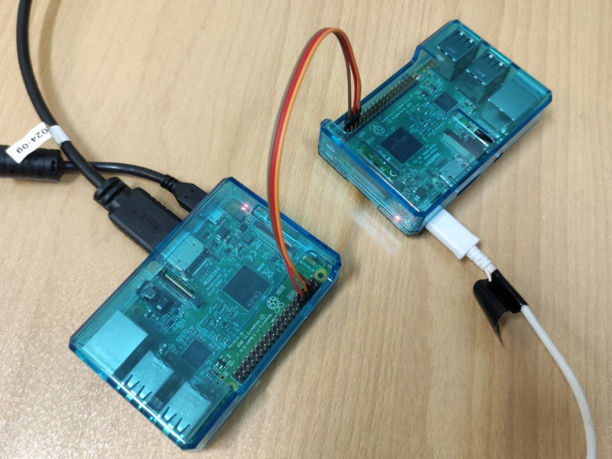
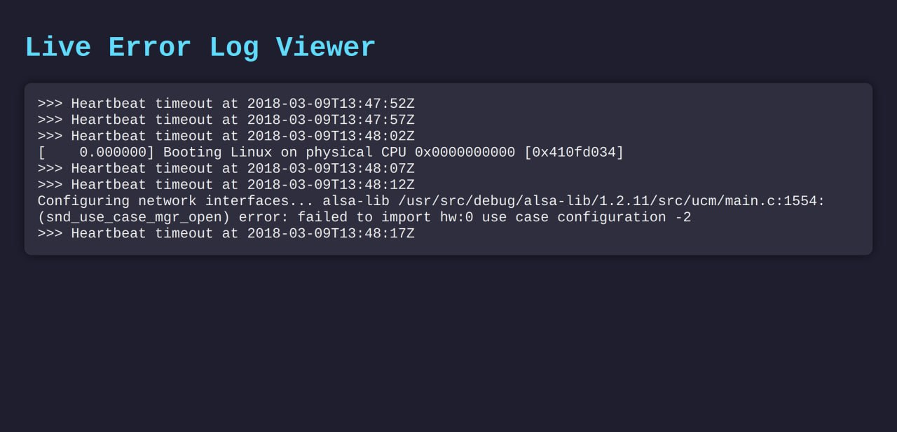

# Yocto Health Watcher

Yocto Health Watcher is a monitoring system for Yocto-based Raspberry Pi boards. It detects errors via the UART
interface and checks the aliveness of the main board.

## Tools

- Two Raspberry Pi 3B boards running Yocto OS
- Go programming language for the watcher application

## Implementation Details



This project involves building a Yocto OS image and running it on two Raspberry Pi boards:

- **Main Board**: The primary board that runs your target application.
- **Watcher Board**: Monitors the main board via UART and logs errors.

We developed a Go program called [`raspberry-pi-uart-watcher`](Code/uart-watcher), which is deployed on the watcher board. The program
continuously monitors logs from the main board through the UART interface and checks for both kernel errors and
keep-alive messages.

## How to Run

To deploy the watcher, follow the instructions in the [README.md](Code/Readme.md).
In brief:

- Set the IP address of your Raspberry Pi in the Makefile.
- Run the following command:

```shell
  make deploy
```

The watcher will start monitoring the main board automatically.

You can test the system by simulating a crash on the main board. The watcher will log errors and display them on the UI
panel.

## Results

If the main board crashes or fails to send keep-alive messages, the watcher logs the events in the errors file and
displays them in the UI panel. Kernel errors are also detected and reported in real time.



## Related Links

- [Yocto Project](https://www.yoctoproject.org/)

## Authors

Authors and their github link come here.

- [@satayyeb](https://github.com/satayyeb)
- [@satayyeb](https://github.com/satayyeb)
- [@satayyeb](https://github.com/satayyeb)

